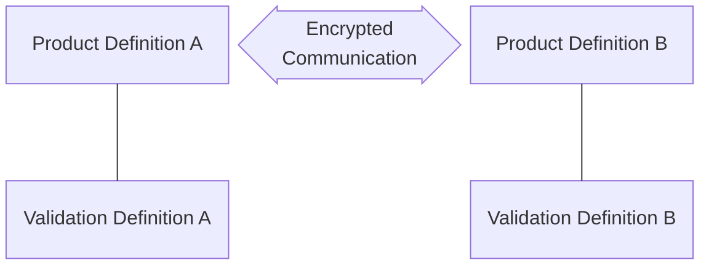

# Cryptographic Modules

## Cryptographic Modules Tables

FedRAMP requests that cryptographic module information be enumerated in three scenarios:

- [Data in Transit (DIT)](#cryptographic-modules-implemented-for-data-in-transit-dit) - must document information about the modules used at each end  of the cryptographic communication.
- [Data at Rest (DAR)](#cryptographic-modules-implemented-for-data-at-rest-dar) - must document information about encryption modules used to protect stored data, such as in a database or on storage volume/disk.
- [Other Uses of Cryptography](#other-uses-of-cryptography) - must document any other scenario where cryptography is involved, such as checksums, digital signatures, and multi-factor authentication (MFA).

The [FedRAMP SSP Appendix Q (Cryptographic Modules Table)](https://www.fedramp.gov/assets/resources/templates/SSP-Appendix-Q-Cryptographic-Modules-Table.docx) provides tables for documenting each of these three scenarios, with the following data requirements:

| Field                      | DIT | DAR | Other | OSCAL Representation |
|----------------------------|:---:|:---:|:---:|:--------------------:|
| Ref #                      | x (1)  | x   | x     | TBD. In OSCAL, component references can be established via UUID, eliminating the need for a separate "Ref #" field. |
| Area of Use (DIT/DAR/Other)  | x (1)   | x   | x     | `//component[@type=("software", "service")]/description` describing the component or asset where the FIPS-140 validated cryptographic module is located. |
| **Crypto-Module Validation**   ||||                      |
| - Cert #                   | x (1) | x   | x     | The validation component's `//component[@type="validation"]/prop[@name="validation-reference"]` |
| - Nature of Implementation | x (1) | x   | x     | TBD |
| - Vendor Name              | x (1) | x   | x     | `//component[@type=("software", "service")][./prop[@name="asset-type" and@value="cryptographic-module"]]/prop[@name="vendor-name" and @ns="http://fedramp.gov/ns/oscal"]/@value` |
| - Module Name              | x (1) | x   | x     | `//component[@type=("software", "service")][./prop[@name="asset-type" and@value="cryptographic-module"]]/prop[@name="software-name"]/@value` |
| **Area of Use (DIT/DAR/Other)**  | x (2) |     |       | `//component[@type=("software", "service")]/description` describing the component or asset where the FIPS-140 validated cryptographic module is located. |
| **Crypto-Module Validation**   ||||                      |
| - Cert #                   | x (2) |     |       |The validation component's `//component[@type="validation"]/prop[@name="validation-reference"]` |
| - Nature of Implementation | x (2) |     |       | TBD |
| - Vendor Name              | x (2) |     |       | `//component[@type=("software", "service")][./prop[@name="asset-type" and@value="cryptographic-module"]]/prop[@name="vendor-name" and @ns="http://fedramp.gov/ns/oscal"]/@value` |
| - Module Name              | x (2) |     |       | `//component[@type=("software", "service")][./prop[@name="asset-type" and@value="cryptographic-module"]]/prop[@name="software-name"]/@value` |
| Encryption Type            |     | x   | x     | TBD |
| Usage                      |     |     |       |                      |
| - Statement                | x   |     |       | `prop[@name="function" and @ns="http://fedramp.gov/ns/oscal"]/remarks` |
| - Specification            | x   |     |       | `component/prop[@name="function" and @ns="http://fedramp.gov/ns/oscal"]/@value` |
| Notes                      | x   | x   | x     | `component/remarks`|


**NOTE**

(1) - For DIT, this indicates that these are fields associated with the "Source" component(s). 

(2) - For DIT, this indicates that these are fields associated with the "Destination" component(s).



FedRAMP requires the use of the `component` assembly to represent these concepts in OSCAL.  SSP authors should review [FedRAMP's OSCAL component documentation](/documentation/ssp/overview-components/) for a foundational understanding of FedRAMP's use of components prior to delving into the guidance below for documenting cryptographic modules with components.

---
## Cryptographic Modules Implemented for Data-in-Transit (DIT) 

Cloud-based systems inherently require the transmission of data between endpoints, and FedRAMP has requirements for the encryption of data-in-transit.  The figure below illustrates how to model data-in-transit in OSCAL using two product/validation `component` pairs.     

In this approach, the subject (e.g., the service or product) is treated separately from the independent validation of the subject (see [Representing Test Validation Information for Components](https://pages.nist.gov/OSCAL/learn/tutorials/implementation/validation-modeling/)). This means when using components with FIPS 140 validated cryptographic modules, there must be two `component` assemblies:

- **The Validation Definition**: A `component` that provides details about the validation.
- **The Product Definition**: A `component` that describes the hardware or software product containing the cryptographic module.

The validation definition is a `component` that provides details about the independent validation. Its type must have a value of "validation". In the case of FIPS 140 validation, this must include a `link` field with a `rel` value set to "validation-details". This `link` must point to the cryptographic module's entry in the NIST Computer Security
Resource Center (CSRC) [Cryptographic Module Validation Program Database](https://csrc.nist.gov/projects/cryptographic-module-validation-program/validated-modules/search).

The product definition is a product with a cryptographic module. It must contain all of the typical `component` information suitable for reference by inventory-items and control statements. It must also include a `link` field with a `rel` value set to "validation" and an `href` value containing a URI fragment. The fragment must start with a hashtag (#) and include the UUID value of the validation `component`. This links the two together.



##### Component Representation: Example Product with FIPS 140-2 Validation

{}

{
    "TODO": "add JSON example code"
}

{}
{}

<!-- system-characteristics -->
<system-implementation>
    <!-- user -->
    <!-- Minimum Required Components -->
    
    <!-- FIPS 140-2 Validation Certificate Information -->
    <!-- Include a separate component for each relevant certificate -->
    <component uuid="uuid-value" type="validation">
        <title>Module Name</title>
        <description>
FIPS 140-2 Validated Module
</description>
        <prop ns="https://fedramp.gov/ns/oscal" name="asset-type" 
              value="cryptographic-module" />
        <prop ns="https://fedramp.gov/ns/oscal" name="vendor-name" 
              value="CM Vendor"/>
        <prop ns="https://fedramp.gov/ns/oscal" name="cryptographic-module-usage" 
              value="data-in-transit"/>
        <prop name="validation-type" value="fips-140-2"/>
        <prop name="validation-reference" value="0000"/>
        <link href="https://csrc.nist.gov/projects/cryptographic-module-validation-program/Certificate/0000" rel="validation-details" />
        <status state="operational" />
    </component>
    
    <!-- FIPS 140-2 Validated Product -->
    <component uuid="uuid-value" type="software" >
        <title>Product Name</title>
        <description>
A product with a cryptographic module.
</description>
        <link href="#uuid-of-validation-component" rel="validation" />
        <status state="operational" />
    </component>
    
    <!-- service -->
</system-implementation>
<!-- control-implementation -->

{}
{}

    TODO:
        add: YAML example code

{}
{}

---
## Cryptographic Modules Implemented for Data-at-Rest (DAR)

The approach is the same as in the [*cryptographic module data-in-transit*](#cryptographic-modules-implemented-for-data-in-transit-dit) section.



##### Component Representation: Example Product with FIPS 140-2 Validation

{}

{
    "TODO": "add JSON example code"
}

{}
{}

<!-- system-characteristics -->
<system-implementation>
    <!-- user -->
    <!-- Minimum Required Components -->
    
    <!-- FIPS 140-2 Validation Certificate Information -->
    <!-- Include a separate component for each relevant certificate -->
    <component uuid="uuid-value" type="validation">
        <title>Module Name</title>
        <description>
FIPS 140-2 Validated Module
</description>
        <prop ns="https://fedramp.gov/ns/oscal" name="asset-type" 
              value="cryptographic-module" />
        <prop ns="https://fedramp.gov/ns/oscal" name="vendor-name" 
              value="CM Vendor"/>
        <prop ns="https://fedramp.gov/ns/oscal" name="cryptographic-module-usage" 
              value="data-at-rest"/>
        <prop name="validation-type" value="fips-140-2"/>
        <prop name="validation-reference" value="0000"/>
        <link href="https://csrc.nist.gov/projects/cryptographic-module-validation-program/Certificate/0000" rel="validation-details" />
        <status state="operational" />
    </component>
    
    <!-- FIPS 140-2 Validated Product -->
    <component uuid="uuid-value" type="software" >
        <title>Product Name</title>
        <description>
A product with a cryptographic module.
</description>
        <link href="#uuid-of-validation-component" rel="validation" />
        <status state="operational" />
    </component>
    
    <!-- service -->
</system-implementation>
<!-- control-implementation -->

{}
{}

TODO - add YAML example code

{}
{}

---
## Other Uses of Cryptography




{}

{
    "TODO": "add JSON example code"
}

{}
{}

	<todo>
		<add>XML sample code</add>
	</todo>

{}
{}

TODO - add YAML example code

{}
{}