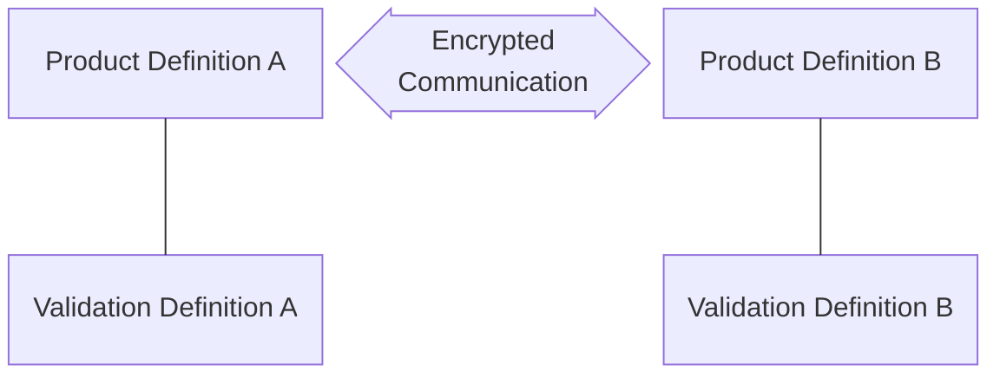
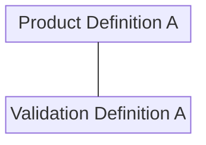

# Cryptographic Modules

## Cryptographic Modules Tables

FedRAMP requests that cryptographic module information be enumerated in three scenarios:

- [Data in Transit (DIT)](#cryptographic-modules-implemented-for-data-in-transit-dit) - must document information about the modules used at each end  of the cryptographic communication.
- [Data at Rest (DAR)](#cryptographic-modules-implemented-for-data-at-rest-dar) - must document information about encryption modules used to protect stored data, such as in a database or on storage volume/disk.
- [Other Uses of Cryptography](#other-uses-of-cryptography) - must document any other scenario where cryptography is involved, such as checksums, digital signatures, and multi-factor authentication (MFA).

The [FedRAMP SSP Appendix Q (Cryptographic Modules Table)](https://www.fedramp.gov/assets/resources/templates/SSP-Appendix-Q-Cryptographic-Modules-Table.docx) provides tables for documenting each of these three scenarios. For OSCAL, FedRAMP requires the use of the `component` assembly to represent these concepts.  OSCAL SSP authors should review [FedRAMP's OSCAL component documentation](/documentation/ssp/overview-components/) for a foundational understanding of FedRAMP's use of components prior to delving into the guidance for documenting cryptographic modules with components.  Below is a summary mapping of the cryptographic modules table field requirements, scenarios, and corresponding OSCAL representations.

<b>DIT, DAR, and Other Cryptographic Table Fields</b>

| Field                      | DIT | DAR | Other | OSCAL Representation |
|----------------------------|:---:|:---:|:---:|:--------------------:|
| Area of Use (DIT/DAR/Other)  | x (1)   | x   | x     | `//component[@type=("software", "service")]/description` describing the component or asset where the FIPS-140 validated cryptographic module is located. |
| **Crypto-Module Validation**   ||||                      |
| - Cert #                   | x (1) | x   | x     | The validation component's reference number (e.g., [CMVP](https://csrc.nist.gov/projects/cryptographic-module-validation-program) certificate number) - `//component[@type="validation"]/prop[@name="validation-reference"]` |
| - Nature of Implementation | x (1) | x   | x     | TBD |
| - Vendor Name              | x (1) | x   | x     | `//component[@type=("software", "service")][./prop[@name="asset-type" and@value="cryptographic-module"]]/prop[@name="vendor-name" and @ns="http://fedramp.gov/ns/oscal"]/@value` |
| - Module Name              | x (1) | x   | x     | `//component[@type=("software", "service")][./prop[@name="asset-type" and@value="cryptographic-module"]]/prop[@name="software-name"]/@value` |
| **Area of Use (DIT/DAR/Other)**  | x (2) |     |       | `//component[@type=("software", "service")]/description` describing the component or asset where the FIPS-140 validated cryptographic module is located. |
| **Crypto-Module Validation**   ||||                      |
| - Cert #                   | x (2) |     |       | The validation component's reference number (e.g., [CMVP](https://csrc.nist.gov/projects/cryptographic-module-validation-program) certificate number) - `//component[@type="validation"]/prop[@name="validation-reference"]` |
| - Nature of Implementation | x (2) |     |       | TBD |
| - Vendor Name              | x (2) |     |       | `//component[@type=("software", "service")][./prop[@name="asset-type" and@value="cryptographic-module"]]/prop[@name="vendor-name" and @ns="http://fedramp.gov/ns/oscal"]/@value` |
| - Module Name              | x (2) |     |       | `//component[@type=("software", "service")][./prop[@name="asset-type" and@value="cryptographic-module"]]/prop[@name="software-name"]/@value` |
| Encryption Type            |     | x   | x     | TBD |
| Usage                      |     |     |       |                      |
| - Statement                | x   |     |       | `prop[@name="function" and @ns="http://fedramp.gov/ns/oscal"]/remarks` |
| - Specification            | x   |     |       | `component/prop[@name="function" and @ns="http://fedramp.gov/ns/oscal"]/@value` |
| Notes                      | x   | x   | x     | `component/remarks`|


**NOTE**

(1) - For DIT, this indicates that these are fields associated with the "Source" component(s). 

(2) - For DIT, this indicates that these are fields associated with the "Destination" component(s).



### General Requirements for Cryptographic Module Components

A cryptographic module is represented as a "software" or "hardware" `component` with an "asset-type" `prop` value of "cryptographic-module".  All cryptographic modules must have the following, which are required of all software components:

  - "software-name" `prop`
  - "software-version" `prop`
  - "vendor-name" `prop`
  - "function" FedRAMP Extension `prop`
  - "function" FedRAMP Extension / Remarks

Cryptographic module's allowed values for "function" are:
  - `data-at-rest`: The cryptographic module is used to encrypt/decrypt data at rest, such as on a hard drive or in a database.
  - `data-in-transit`: The cryptographic module is used to encrypt/decrypt data being communicated, such as over a TLS connection.
  - `other`: The cryptographic module is used as described in the remarks.

Cryptographic module must have
  - At least one "provided-by" `link` indicating where the module exists (e.g., source "operating-system" `component`).
  - At least one "used-by" `link` indicating which component(s) use this cryptographic module.
  - At least one "provided-by" `link` indicating where the module exists (e.g., source "operating-system" `component`).
  - At least one "validation" `link` that references a FIPS 140-2 or 140-3 "validation" `component`.  
    - A cryptographic module may identify more than one "validation" component, but at least one must be a FIPS "validation" component.

### FIPS Validation Components

While other forms of validation may be documented in the SSP using "validation" `component`s, FedRAMP is primarily interested in FIPS "validation" components. These are identified by ALL of the following:
- `component` with `type="validation"`
- "asset-type" `prop` with value set to "cryptographic-module"
- "validation-type" `prop` with value set to either "fips-140-2" or "fips-140-3"
- must have a "validation-reference" `prop` with its value set to NIST CMVP Lab-assigned certificate number
- must have a "proof-of-compliance" `link` with an `hrref` value that is resolvable on the public internet. 

---
## Cryptographic Modules Implemented for Data-in-Transit (DIT) 

Cloud-based systems inherently require the transmission of data between endpoints, and FedRAMP has requirements for the encryption of data-in-transit.  The figure below illustrates how to model data-in-transit in OSCAL using two product/validation `component` pairs.     

In this approach, the subject (e.g., the service or product that provided cryptographic protection) is treated separately from the independent validation of the subject (see [Representing Test Validation Information for Components](https://pages.nist.gov/OSCAL/learn/tutorials/implementation/validation-modeling/)). This means when using components with FIPS 140 validated cryptographic modules, there must be two `component` assemblies:

- **The Validation Definition**: A `component` that provides details about the validation.
- **The Product Definition**: A `component` that describes the hardware or software product containing the cryptographic module.

The validation definition is a `component` that provides details about the independent validation. Its `component` `type` must have a value of "validation". In the case of FIPS 140 validation, this `component` must include a `link` field with a `rel` value set to "validation-details". This `link` must point to the cryptographic module's entry in the NIST Computer Security
Resource Center (CSRC) [Cryptographic Module Validation Program Database](https://csrc.nist.gov/projects/cryptographic-module-validation-program/validated-modules/search).

The product definition is a product with a cryptographic module. It must contain all of the typical `component` information suitable for reference by inventory-items and control statements. It must also include a `link` field with a `rel` value set to "validation" and an `href` value containing a URI fragment. The fragment must start with a hashtag (#) and include the UUID value of the validation `component`. This links the two together so that it is clear if and how the cryptographic module was independently validated.



**NOTE**

FedRAMP is evaluating the addition of a new `component` `type` of "connection" that should be used in any scenarios that involve communication between endpoints, such as:
- Leveraged Authorizations
- Interconnections
- External Services

For more details on the intended use and implementation of "connection" components, see the [OSCAL SSP Components Overview](/documentation/ssp/overview-components/#scenario).



The following is a screenshot of how DIT cryptographic module information is captured in the FedRAMP SSP Appendix Q.



FedRAMP guidance for representing this information OSCAL is summarized in the [Cryptographic Modules Tables](#cryptographic-modules-tables) section, and illustrated in the code examples below, which include:
- [DIT Product A with Validation A](#component-representation-example-dit-product-a-with-fips-140-2-validation-a)
- [DIT encrypted communication](#component-representation-example-dit-encrypted-connection)
- [DIT Product B with Validation B](#component-representation-example-dit-product-b-with-fips-140-2-validation-b) 

##### Component Representation: Example DIT Product A with FIPS 140-2 Validation A

This first example shows the product and validation definitions for the DIT source. "Product A" is the DIT source's cryptographic module and is depicted by the `component` with UUID equal to `11111111-2222-4000-8000-009001200003`.  Product A references the `component` for "Validation A".  The `component` for "Product A" must meet all the [general requirements for cryptographic module components](#general-requirements-for-cryptographic-module-components) and the `component` for "Validation A" must meet all the [FIPS validation component requirements](#fips-validation-components).


{}

{
    "system-security-plan": {
        "system-implementation": {
            "components": [
                {
                    "uuid": "11111111-2222-4000-8000-009001200003",
                    "type": "software",
                    "title": "OpenSSL",
                    "description": "Provide a description and any pertinent note regarding the use of this CM.\n\nFor data-at-rest modules, describe type of encryption implemented (e.g., full disk, file, record-level, etc.)\n\nLastly, provide any supporting notes on FIPS status (e.g. historical) or lack of FIPS compliance (e.g., Module in Process).",
                    "props": [
                        {
                            "name": "asset-type",
                            "value": "cryptographic-module"
                        },
                        {
                            "name": "software-name",
                            "value": "OpenSSL"
                        },
                        {
                            "name": "software-version",
                            "value": "3.0.8"
                        },
                        {
                            "name": "vendor-name",
                            "ns": "http://fedramp.gov/ns/oscal",
                            "value": "OpenSSL FIPS Provider"
                        },
                        {
                            "name": "function",
                            "ns": "http://fedramp.gov/ns/oscal",
                            "value": "data-in-transit",
                            "remarks": "Usage statement"
                        }
                    ],
                    "links": [
                        {
                            "href": "#11111111-2222-4000-8000-009001200001",
                            "rel": "validation",
                            "text": "A link to the 3rd party validation information related to this cryptographic module."
                        },
                        {
                            "href": "#",
                            "rel": "provided-by"
                        }
                    ],
                    "status": {"state": "operational"}
                },
                {
                    "uuid": "11111111-2222-4000-8000-009001200001",
                    "type": "validation",
                    "title": "OpenSSL FIPS 140-2 Validation",
                    "description": "Describe any relevant information regarding this validation of the CM.",
                    "props": [
                        {
                            "name": "asset-type",
                            "value": "cryptographic-module"
                        },
                        {
                            "name": "validation-type",
                            "value": "fips-140-2"
                        },
                        {
                            "name": "validation-reference",
                            "value": "4811"
                        }
                    ],
                    "links": [
                        {
                            "href": "https://csrc.nist.gov/projects/cryptographic-module-validation-program/certificate/4811",
                            "rel": "proof-of-compliance"
                        }
                    ],
                    "status": {"state": "operational"},
                    "remarks": "."
                }
            ]
        }
    }
}

{}
{}

<system-security-plan>
    <system-implementation>

        <component type="software" uuid="11111111-2222-4000-8000-009001200003">
            <title>OpenSSL</title>
            <description>
                
Provide a description and any pertinent note regarding the use of this CM.

                
For data-at-rest modules, describe type of encryption implemented (e.g., full disk, file,
                record-level, etc.)

                
Lastly, provide any supporting notes on FIPS status (e.g. historical) or lack of FIPS
                compliance (e.g., Module in Process).

            </description>
            <prop name="asset-type" value="cryptographic-module"/>
            <prop name="software-name" value="OpenSSL"/>
            <prop name="software-version" value="3.0.8"/>
            <prop name="vendor-name" value="OpenSSL FIPS Provider" ns="http://fedramp.gov/ns/oscal"/>
            <prop name="function" value="data-in-transit" ns="http://fedramp.gov/ns/oscal">
                <remarks>
                
Usage statement

                </remarks>
            </prop>
            <link rel="validation" href="#11111111-2222-4000-8000-009001200001">
                <text>A link to the 3rd party validation information related to this cryptographic
                module.</text>
            </link>
            <link rel="provided-by" href="#"/>
            <status state="operational"/>
        </component>
        
        <component uuid="11111111-2222-4000-8000-009001200001" type="validation">
            <title>OpenSSL FIPS 140-2 Validation</title>
            <description>
                
Describe any relevant information regarding this validation of the CM.

            </description>
            <prop name="asset-type" value="cryptographic-module"/>
            <prop name="validation-type" value="fips-140-2"/>
            <prop name="validation-reference" value="4811"/>
            <link rel="proof-of-compliance"
                href="https://csrc.nist.gov/projects/cryptographic-module-validation-program/certificate/4811"/>
            <status state="operational"/>
            <remarks>
                
.

            </remarks>
        </component>
        
    </system-implementation>
</system-security-plan>

{}
{}

system-security-plan:
    system-implementation:
        components:
        - uuid: 11111111-2222-4000-8000-009001200003
          type: software
          title: OpenSSL
          description: |-
              Provide a description and any pertinent note regarding the use of this CM.

              For data-at-rest modules, describe type of encryption implemented (e.g., full disk, file, record-level, etc.)

              Lastly, provide any supporting notes on FIPS status (e.g. historical) or lack of FIPS compliance (e.g., Module in Process).
          props:
          - name: asset-type
              value: cryptographic-module
          - name: software-name
              value: OpenSSL
          - name: software-version
              value: 3.0.8
          - name: vendor-name
              ns: http://fedramp.gov/ns/oscal
              value: OpenSSL FIPS Provider
          - name: function
              ns: http://fedramp.gov/ns/oscal
              value: data-in-transit
              remarks: Usage statement
          links:
          - href: '#11111111-2222-4000-8000-009001200001'
              rel: validation
              text: A link to the 3rd party validation information related to this cryptographic module.
          - href: '#'
              rel: provided-by
          status:
              state: operational

        - uuid: 11111111-2222-4000-8000-009001200001
          type: validation
          title: OpenSSL FIPS 140-2 Validation
          description: Describe any relevant information regarding this validation of the CM.
          props:
          - name: asset-type
              value: cryptographic-module
          - name: validation-type
              value: fips-140-2
          - name: validation-reference
              value: '4811'
          links:
          - href: https://csrc.nist.gov/projects/cryptographic-module-validation-program/certificate/4811
              rel: proof-of-compliance
          status:
              state: operational
          remarks: .


{}
{}

##### Component Representation: Example DIT encrypted connection

This second example shows the "connection" `component` used to document the encrypted communication between the DIT source and destination components.  Connection components have the same standard requirements as other components, but must also meet the following requirements:
- `component` `type` set to "connection"
- must have an "asset-type" `prop`.  Its value should be set to "encrypted".  FedRAMP will presume the connection is "unencrypted" if the `prop` is missing or set to any value other than "encrypted".
- must have an "asset-id" `prop`.  Its value should be used as the "Ref #" (e.g., on data flows, etc.)
- must have at least two `link` assemblies with `rel` set to "used-by" to identify the source and destination components.


{}

{
    "system-security-plan": {
        "system-implementation": {
            "components": [
                {
                    "uuid": "11111111-2222-4000-8000-009001400001",
                    "type": "connection",
                    "title": "Database Queries",
                    "description": "An encryptred communication between the API server and the database server for the purpose of performing SQL queries.",
                    "props": [
                        {
                            "name": "asset-type",
                            "value": "encrypted"
                        },
                        {
                            "name": "asset-id",
                            "value": "ref-01"
                        },
                        {
                            "name": "connection-security",
                            "ns": "http://fedramp.gov/ns/oscal",
                            "value": "tls-1.3"
                        },
                        {
                            "name": "diagram-label",
                            "ns": "http://fedramp.gov/ns/oscal",
                            "value": "Database Queries"
                        }
                    ],
                    "links": [
                        {
                            "href": "#11111111-2222-4000-8000-009000300100",
                            "rel": "used-by"
                        },
                        {
                            "href": "#11111111-2222-4000-8000-009000300200",
                            "rel": "used-by"
                        }
                    ],
                    "status": {"state": "operational"},
                    "remarks": "Provide any notes here about this connection that you wish to appear in Table Q."
                }
            ]
        }
    }
}

{}
{}

<system-security-plan>
    <system-implementation>
        <component uuid="11111111-2222-4000-8000-009001400001" type="connection">
            <title>Database Queries</title>
            <description>
                
An encryptred communication between the API server and the database server for the
                purpose of performing SQL queries.

            </description>
            <prop name="asset-type" value="encrypted"/>
            <prop name="asset-id" value="ref-01"/>
            <prop name="connection-security" value="tls-1.3" ns="http://fedramp.gov/ns/oscal"/>
            <prop name="diagram-label" value="Database Queries" ns="http://fedramp.gov/ns/oscal"/>
            <link rel="used-by" href="#11111111-2222-4000-8000-009000300100"/>
            <link rel="used-by" href="#11111111-2222-4000-8000-009000300200"/>
            <status state="operational"/>
            <remarks>
                
Provide any notes here about this connection that you wish to appear in Table Q.

            </remarks>
        </component>
    </system-implementation>
</system-security-plan>

{}
{}

system-security-plan:
    system-implementation:
        components:
        - uuid: 11111111-2222-4000-8000-009001400001
          type: connection
          title: Database Queries
          description: An encryptred communication between the API server and the database server for the
              purpose of performing SQL queries.
          props:
          - name: asset-type
              value: encrypted
          - name: asset-id
              value: ref-01
          - name: connection-security
              ns: http://fedramp.gov/ns/oscal
              value: tls-1.3
          - name: diagram-label
              ns: http://fedramp.gov/ns/oscal
              value: Database Queries
          links:
          - href: '#11111111-2222-4000-8000-009000300100'
              rel: used-by
          - href: '#11111111-2222-4000-8000-009000300200'
              rel: used-by
          status:
              state: operational
          remarks: Provide any notes here about this connection that you wish to appear in Table Q.


{}
{}

##### Component Representation: Example DIT Product B with FIPS 140-2 Validation B

Finally, this third DIT example shows the product and validation definitions for the DIT destination `component`. "Product B" is the DIT destination's cryptographic module and is depicted by the `component` with UUID equal to `11111111-2222-4000-8000-009001200XXX`.  Product B references the `component` for "Validation B".  The `component` for "Product B" must meet all the [general requirements for cryptographic module components](#general-requirements-for-cryptographic-module-components) and the `component` for "Validation B" must meet all the [FIPS validation component requirements](#fips-validation-components).


{}

{
    "system-security-plan": {
        "system-implementation": {
            "components": [
                {
                    "uuid": "11111111-2222-4000-8000-009000300011",
                    "type": "software",
                    "title": "OpenSSL",
                    "description": "Provide a description and any pertinent note regarding the use of this CM.\n\nFor data-at-rest modules, describe type of encryption implemented (e.g., full disk, file, record-level, etc.)\n\nLastly, provide any supporting notes on FIPS status (e.g. historical) or lack of FIPS compliance (e.g., Module in Process).",
                    "props": [
                        {
                            "name": "asset-type",
                            "value": "cryptographic-module"
                        },
                        {
                            "name": "software-name",
                            "value": "OpenSSL"
                        },
                        {
                            "name": "software-version",
                            "value": "3.0.9"
                        },
                        {
                            "name": "vendor-name",
                            "ns": "http://fedramp.gov/ns/oscal",
                            "value": "OpenSSL FIPS Provider"
                        },
                        {
                            "name": "function",
                            "ns": "http://fedramp.gov/ns/oscal",
                            "value": "data-in-transit",
                            "remarks": "Usage statement"
                        }
                    ],
                    "links": [
                        {
                            "href": "#11111111-2222-4000-8000-009001200001",
                            "rel": "validation",
                            "text": "A link to the 3rd party validation information related to this cryptographic module."
                        },
                        {
                            "href": "#",
                            "rel": "provided-by",
                            "text": "A link to the operating system component that has this module embedded."
                        },
                        {
                            "href": "#",
                            "rel": "used-by",
                            "text": "A link to the software component that uses this module for encrypted communication."
                        }
                    ],
                    "status": {"state": "operational"}
                },
                {
                    "uuid": "11111111-2222-4000-8000-009001200001",
                    "type": "validation",
                    "title": "OpenSSL FIPS 140-2 Validation",
                    "description": "Describe any relevant information regarding this validation of the CM.",
                    "props": [
                        {
                            "name": "asset-type",
                            "value": "cryptographic-module"
                        },
                        {
                            "name": "validation-type",
                            "value": "fips-140-2"
                        },
                        {
                            "name": "validation-reference",
                            "value": "4811"
                        }
                    ],
                    "links": [
                        {
                            "href": "https://csrc.nist.gov/projects/cryptographic-module-validation-program/certificate/4811",
                            "rel": "proof-of-compliance"
                        }
                    ],
                    "status": {"state": "operational"},
                    "remarks": "."
                }
            ]
        }
    }
}

{}
{}

<system-security-plan>
    <system-implementation>

        <component type="software" uuid="11111111-2222-4000-8000-009000300011">
            <title>OpenSSL</title>
            <description>
                
Provide a description and any pertinent note regarding the use of this CM.

                
For data-at-rest modules, describe type of encryption implemented (e.g., full disk, file,
                record-level, etc.)

                
Lastly, provide any supporting notes on FIPS status (e.g. historical) or lack of FIPS
                compliance (e.g., Module in Process).

            </description>
            <prop name="asset-type" value="cryptographic-module"/>
            <prop name="software-name" value="OpenSSL"/>
            <prop name="software-version" value="3.0.9"/>
            <prop name="vendor-name" value="OpenSSL FIPS Provider" ns="http://fedramp.gov/ns/oscal"/>
            <prop name="function" value="data-in-transit" ns="http://fedramp.gov/ns/oscal">
                <remarks>
                
Usage statement

                </remarks>
            </prop>
            <link rel="validation" href="#11111111-2222-4000-8000-009001200001">
                <text>A link to the 3rd party validation information related to this cryptographic
                module.</text>
            </link>
            <link rel="provided-by" href="#">
                <text>A link to the operating system component that has this module embedded.</text>
            </link>
            <link rel="used-by" href="#">
                <text>A link to the software component that uses this module for encrypted
                communication.</text>
            </link>
            <status state="operational"/>
        </component>
        
        <component uuid="11111111-2222-4000-8000-009001200001" type="validation">
            <title>OpenSSL FIPS 140-2 Validation</title>
            <description>
                
Describe any relevant information regarding this validation of the CM.

            </description>
            <prop name="asset-type" value="cryptographic-module"/>
            <prop name="validation-type" value="fips-140-2"/>
            <prop name="validation-reference" value="4811"/>
            <link rel="proof-of-compliance"
                href="https://csrc.nist.gov/projects/cryptographic-module-validation-program/certificate/4811"/>
            <status state="operational"/>
            <remarks>
                
.

            </remarks>
        </component>
        
    </system-implementation>
</system-security-plan>

{}
{}

system-security-plan:
    system-implementation:
        components:
        - uuid: 11111111-2222-4000-8000-009000300011
          type: software
          title: OpenSSL
          description: |-
              Provide a description and any pertinent note regarding the use of this CM.

              For data-at-rest modules, describe type of encryption implemented (e.g., full disk, file, record-level, etc.)

              Lastly, provide any supporting notes on FIPS status (e.g. historical) or lack of FIPS compliance (e.g., Module in Process).
          props:
          - name: asset-type
              value: cryptographic-module
          - name: software-name
              value: OpenSSL
          - name: software-version
              value: 3.0.9
          - name: vendor-name
              ns: http://fedramp.gov/ns/oscal
              value: OpenSSL FIPS Provider
          - name: function
              ns: http://fedramp.gov/ns/oscal
              value: data-in-transit
              remarks: Usage statement
          links:
          - href: '#11111111-2222-4000-8000-009001200001'
              rel: validation
              text: A link to the 3rd party validation information related to this cryptographic module.
          - href: '#'
              rel: provided-by
              text: A link to the operating system component that has this module embedded.
          - href: '#'
              rel: used-by
              text: A link to the software component that uses this module for encrypted communication.
          status:
              state: operational

        - uuid: 11111111-2222-4000-8000-009001200001
          type: validation
          title: OpenSSL FIPS 140-2 Validation
          description: Describe any relevant information regarding this validation of the CM.
          props:
          - name: asset-type
              value: cryptographic-module
          - name: validation-type
              value: fips-140-2
          - name: validation-reference
              value: '4811'
          links:
          - href: https://csrc.nist.gov/projects/cryptographic-module-validation-program/certificate/4811
              rel: proof-of-compliance
          status:
              state: operational
          remarks: .


{}
{}

---
## Cryptographic Modules Implemented for Data-at-Rest (DAR)

The FedRAMP approach for representing data-at-rest (DAR) in OSCAL is similar the [*cryptographic module data-in-transit*](#cryptographic-modules-implemented-for-data-in-transit-dit) approach, except that only one product/validation definition `component` pair is needed and the cryptographic module `component` must have a "function" `prop` with its value set to "data-at-rest".  

The following is a screenshot of how DAR cryptographic module information is captured in the FedRAMP SSP Appendix Q.



##### Component Representation: Example DAR Product A with FIPS 140-2 Validation A

In the example below, "Product A" is the DAR cryptographic module and is depicted by the `component` with UUID equal to `11111111-2222-4000-8000-009001200xxx`.  Product A references the `component` for "Validation A".  The `component` for "Product A" must meet all the [general requirements for cryptographic module components](#general-requirements-for-cryptographic-module-components) and the `component` for "Validation A" must meet all the [FIPS validation component requirements](#fips-validation-components).


{}

{
    "system-security-plan": {
        "system-implementation": {
            "components": [
                {
                    "uuid": "11111111-2222-4000-8000-009000300012",
                    "type": "software",
                    "title": "Database Row Encryption Module",
                    "description": "Briefly describe the cryptographic module.",
                    "props": [
                        {
                            "name": "asset-type",
                            "value": "cryptographic-module"
                        },
                        {
                            "name": "software-name",
                            "value": "abc"
                        },
                        {
                            "name": "software-version",
                            "value": "1.2.3"
                        },
                        {
                            "name": "vendor-name",
                            "ns": "http://fedramp.gov/ns/oscal",
                            "value": "Databases-R-Us"
                        },
                        {
                            "name": "function",
                            "ns": "http://fedramp.gov/ns/oscal",
                            "value": "data-at-rest",
                            "remarks": "Used to encrypt and decrypt rows in the database."
                        }
                    ],
                    "links": [
                        {
                            "href": "#11111111-2222-4000-8000-009001200001",
                            "rel": "validation",
                            "text": "A link to the 3rd party validation information related to this cryptographic module."
                        },
                        {
                            "href": "#",
                            "rel": "provided-by",
                            "text": "A link to the operating system component that has this module embedded."
                        },
                        {
                            "href": "#",
                            "rel": "used-by",
                            "text": "A link to the software component that uses this module for encrypted communication."
                        }
                    ],
                    "status": {"state": "operational"}
                },
                {
                    "uuid": "11111111-2222-4000-8000-009001200001",
                    "type": "validation",
                    "title": "OpenSSL FIPS 140-2 Validation",
                    "description": "Describe any relevant information regarding this validation of the CM.",
                    "props": [
                        {
                            "name": "asset-type",
                            "value": "cryptographic-module"
                        },
                        {
                            "name": "validation-type",
                            "value": "fips-140-2"
                        },
                        {
                            "name": "validation-reference",
                            "value": "4811"
                        }
                    ],
                    "links": [
                        {
                            "href": "https://csrc.nist.gov/projects/cryptographic-module-validation-program/certificate/4811",
                            "rel": "proof-of-compliance"
                        }
                    ],
                    "status": {"state": "operational"},
                    "remarks": "."
                }
            ]
        }
    }
}

{}
{}

<system-security-plan>
    <system-implementation>

        <component type="software" uuid="11111111-2222-4000-8000-009000300012">
            <title>Database Row Encryption Module</title>
            <description>
                
Briefly describe the cryptographic module.

            </description>
            <prop name="asset-type" value="cryptographic-module"/>
            <prop name="software-name" value="abc"/>
            <prop name="software-version" value="1.2.3"/>
            <prop name="vendor-name" value="Databases-R-Us" ns="http://fedramp.gov/ns/oscal"/>
            <prop name="function" value="data-at-rest" ns="http://fedramp.gov/ns/oscal">
                <remarks>
                
Used to encrypt and decrypt rows in the database.

                </remarks>
            </prop>
            <link rel="validation" href="#11111111-2222-4000-8000-009001200001">
                <text>A link to the 3rd party validation information related to this cryptographic
                module.</text>
            </link>
            <link rel="provided-by" href="#"/>
            <status state="operational"/>
        </component>
        
        <component uuid="11111111-2222-4000-8000-009001200001" type="validation">
            <title>OpenSSL FIPS 140-2 Validation</title>
            <description>
                
Describe any relevant information regarding this validation of the CM.

            </description>
            <prop name="asset-type" value="cryptographic-module"/>
            <prop name="validation-type" value="fips-140-2"/>
            <prop name="validation-reference" value="4811"/>
            <link rel="proof-of-compliance"
                href="https://csrc.nist.gov/projects/cryptographic-module-validation-program/certificate/4811"/>
            <status state="operational"/>
            <remarks>
                
.

            </remarks>
        </component>
        
    </system-implementation>
</system-security-plan>

{}
{}

system-security-plan:
    system-implementation:
        components:
        - uuid: 11111111-2222-4000-8000-009000300012
        type: software
        title: Database Row Encryption Module
        description: Briefly describe the cryptographic module.
        props:
        - name: asset-type
            value: cryptographic-module
        - name: software-name
            value: abc
        - name: software-version
            value: 1.2.3
        - name: vendor-name
            ns: http://fedramp.gov/ns/oscal
            value: Databases-R-Us
        - name: function
            ns: http://fedramp.gov/ns/oscal
            value: data-at-rest
            remarks: Used to encrypt and decrypt rows in the database.
          links:
          - href: '#11111111-2222-4000-8000-009001200001'
              rel: validation
              text: A link to the 3rd party validation information related to this cryptographic module.
          - href: '#'
              rel: provided-by
              text: A link to the operating system component that has this module embedded.
          - href: '#'
              rel: used-by
              text: A link to the software component that uses this module for encrypted communication.
          status:
              state: operational

        - uuid: 11111111-2222-4000-8000-009001200001
          type: validation
          title: OpenSSL FIPS 140-2 Validation
          description: Describe any relevant information regarding this validation of the CM.
          props:
          - name: asset-type
              value: cryptographic-module
          - name: validation-type
              value: fips-140-2
          - name: validation-reference
              value: '4811'
          links:
          - href: https://csrc.nist.gov/projects/cryptographic-module-validation-program/certificate/4811
              rel: proof-of-compliance
          status:
              state: operational
          remarks: .


{}
{}

---
## Other Uses of Cryptography

The FedRAMP approach for representing other cryptographic module uses in OSCAL is identical the [*cryptographic module data-at-rest*](#cryptographic-modules-implemented-for-data-at-rest-dar) approach.

The following is a screenshot of how other cryptographic module information is captured in the FedRAMP SSP Appendix Q (note that the columns are essentially identical to the data at rest table).



#### Component Representation: Example Other Product A with FIPS 140-2 Validation A

The only difference is that the cryptographic module `component` must have a "function" `prop` with its value set to "other", and a more detailed description within the `prop` assembly's `remarks`.


{}

{
    "system-security-plan": {
        "system-implementation": {
            "components": [
                {
                    "uuid": "11111111-2222-4000-8000-009000300012",
                    "type": "software",
                    "title": "Digital Signature",
                    "description": "Briefly describe the cryptographic module.",
                    "props": [
                        {
                            "name": "asset-type",
                            "value": "cryptographic-module"
                        },
                        {
                            "name": "software-name",
                            "value": "abc"
                        },
                        {
                            "name": "software-version",
                            "value": "1.2.3"
                        },
                        {
                            "name": "vendor-name",
                            "ns": "http://fedramp.gov/ns/oscal",
                            "value": "Encryption Security Vendor"
                        },
                        {
                            "name": "function",
                            "ns": "http://fedramp.gov/ns/oscal",
                            "value": "other",
                            "remarks": "Used to for digital signatures on documents."
                        }
                    ],
                    "links": [
                        {
                            "href": "#11111111-2222-4000-8000-009001200001",
                            "rel": "validation",
                            "text": "A link to the 3rd party validation information related to this cryptographic module."
                        },
                        {
                            "href": "#",
                            "rel": "provided-by",
                            "text": "A link to the operating system component that has this module embedded."
                        },
                        {
                            "href": "#",
                            "rel": "used-by",
                            "text": "A link to the software component that uses this module for encrypted communication."
                        }
                    ],
                    "status": {"state": "operational"}
                },
                {
                    "uuid": "11111111-2222-4000-8000-009001200001",
                    "type": "validation",
                    "title": "OpenSSL FIPS 140-2 Validation",
                    "description": "Describe any relevant information regarding this validation of the CM.",
                    "props": [
                        {
                            "name": "asset-type",
                            "value": "cryptographic-module"
                        },
                        {
                            "name": "validation-type",
                            "value": "fips-140-2"
                        },
                        {
                            "name": "validation-reference",
                            "value": "4811"
                        }
                    ],
                    "links": [
                        {
                            "href": "https://csrc.nist.gov/projects/cryptographic-module-validation-program/certificate/4811",
                            "rel": "proof-of-compliance"
                        }
                    ],
                    "status": {"state": "operational"},
                    "remarks": "."
                }
            ]
        }
    }
}

{}
{}

<system-security-plan>
    <system-implementation>

        <component type="software" uuid="11111111-2222-4000-8000-009000300012">
            <title>Digital Signature</title>
            <description>
                
Briefly describe the cryptographic module.

            </description>
            <prop name="asset-type" value="cryptographic-module"/>
            <prop name="software-name" value="abc"/>
            <prop name="software-version" value="1.2.3"/>
            <prop name="vendor-name" value="Encryption Security Vendor" ns="http://fedramp.gov/ns/oscal"/>
            <prop name="function" value="other" ns="http://fedramp.gov/ns/oscal">
                <remarks>
                
Used to for digital signatures on documents.

                </remarks>
            </prop>
            <link rel="validation" href="#11111111-2222-4000-8000-009001200001">
                <text>A link to the 3rd party validation information related to this cryptographic
                module.</text>
            </link>
            <link rel="provided-by" href="#"/>
            <status state="operational"/>
        </component>
        
        <component uuid="11111111-2222-4000-8000-009001200001" type="validation">
            <title>OpenSSL FIPS 140-2 Validation</title>
            <description>
                
Describe any relevant information regarding this validation of the CM.

            </description>
            <prop name="asset-type" value="cryptographic-module"/>
            <prop name="validation-type" value="fips-140-2"/>
            <prop name="validation-reference" value="4811"/>
            <link rel="proof-of-compliance"
                href="https://csrc.nist.gov/projects/cryptographic-module-validation-program/certificate/4811"/>
            <status state="operational"/>
            <remarks>
                
.

            </remarks>
        </component>
        
    </system-implementation>
</system-security-plan>

{}
{}

system-security-plan:
    system-implementation:
        components:
        - uuid: 11111111-2222-4000-8000-009000300012
        type: software
        title: Digital Signature
        description: Briefly describe the cryptographic module.
        props:
        - name: asset-type
            value: cryptographic-module
        - name: software-name
            value: abc
        - name: software-version
            value: 1.2.3
        - name: vendor-name
            ns: http://fedramp.gov/ns/oscal
            value: Encryption Security Vendor
        - name: function
            ns: http://fedramp.gov/ns/oscal
            value: other
            remarks: Used to for digital signatures on documents.
          links:
          - href: '#11111111-2222-4000-8000-009001200001'
              rel: validation
              text: A link to the 3rd party validation information related to this cryptographic module.
          - href: '#'
              rel: provided-by
              text: A link to the operating system component that has this module embedded.
          - href: '#'
              rel: used-by
              text: A link to the software component that uses this module for encrypted communication.
          status:
              state: operational

        - uuid: 11111111-2222-4000-8000-009001200001
          type: validation
          title: OpenSSL FIPS 140-2 Validation
          description: Describe any relevant information regarding this validation of the CM.
          props:
          - name: asset-type
              value: cryptographic-module
          - name: validation-type
              value: fips-140-2
          - name: validation-reference
              value: '4811'
          links:
          - href: https://csrc.nist.gov/projects/cryptographic-module-validation-program/certificate/4811
              rel: proof-of-compliance
          status:
              state: operational
          remarks: .


{}
{}