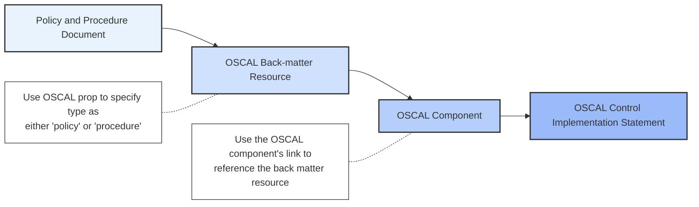

# Policies and Procedures

Policies and procedures (P&Ps) are a critical supplements to FedRAMP SSPs and are required by the first control (known as the “dash ones” (e.g., AC-1)) for each control family. Per [appendix C of the FedRAMP SSP template](https://www.fedramp.gov/assets/resources/templates/FedRAMP-High-Moderate-Low-LI-SaaS-Baseline-System-Security-Plan-(SSP).docx), the following controls must have policies and procedures associated:

 - Policy: AC-1, AT-1, AU-1, CA-1, CM-1, CP-1, IA-1, IR-1, MA-1, MP-1, PE-1, PL-1, PS-1, RA-1, SA-1, SC-1, SI-1, SR-1
 - Procedure: AC-1, AT-1, AU-1, CA-1, CM-1, CP-1, IA-1, IR-1, MA-1, MP-1, PE-1, PL-1, PS-1, RA-1, SA-1, SC-1, SI-1, SR-1


**NOTE**

Other controls, aside from the "dash ones" (e.g., AC-1), may also require CSPs to provide and reference certain policy or procedure documents. CSPs must use the same approach described in this section to represent those policies and procedures in OSCAL. 


Policies provide the guidelines under which the accompanying procedures are developed and by which the SSP controls are implemented whereas procedures define general instructions necessary to implement a control. Note however that CSPs may choose to combine certain policy and procedure documents.  This is acceptable, provided that the policy and procedure attachments account for all the requirements and there is traceability for stakeholders to understand which documents satisfy which controls.

The FedRAMP approach for representing policy and procedure attachments in an OSCAL SSP involves 1) defining the attachments in the back matter resource, 2) creating components that link to the back matter resource, and 3) referencing the components in control implementations statements to provide traceability.  This is illustrated below with more details in the subsequent sections.

---

## Back Matter Resource

Representing policy and procedure documents in OSCAL back matter is consistent with the overall general approach for creating [Attachments in OSCAL Content](/documentation/general-concepts/oscal-attachments/).   The key differences are that:
- Policy and procedure `back-matter` `resource`s must have a "type" `prop` indicating whether this is a "policy" or "procedure" attachment
- Policy and procedure `back-matter` `resource`s should have "published" `prop` that captures when the document was (last) published
- If provided, the "published" `prop` value must match the lexical form of the 'date-time-with-timezone' data type (e.g., 2025-01-01T00:00:00Z).
- Any specified `rlink` must be resolvable and accessible by FedRAMP

#### Representation: Policy and Procedure Back Matter Resource

{}

{
    "system-security-plan": {
        "uuid": "11111111-2222-4000-8000-000000000000",
        "back-matter": {
            "resources": [
                {
                    "uuid": "11111111-2222-4000-8000-001000000005",
                    "title": "Access Control and Identity Management Policy",
                    "description": "A single policy that addresses both the AC and IA families.",
                    "props": [
                        {
                            "name": "type",
                            "value": "policy"
                        },
                        {
                            "name": "published",
                            "value": "2023-01-01T00:00:00Z"
                        },
                        {
                            "name": "version",
                            "value": "1.2"
                        }
                    ],
                    "rlinks": [
                        {
                            "href": "./attachments/policies/sample_AC_and_IA_policy.pdf",
                            "media-type": "application/pdf"
                        }
                    ],
                    "base64": {
                        "filename": "sample_AC_and_IA_policy.pdf",
                        "media-type": "application/pdf",
                        "value": "00000000"
                    },
                    "remarks": "Each policy must be attached as back-matter resources, and must include:\n\n* a title field with the attached document's published title.\n* a \\\"type\\\" property with a value of \\\"policy\\\".\n* a \\\"published\\\" property with the attached document's publication date.\n* a \\\"version\\\" property with the attached document's published version.\n* Either base64 embedded attachment or an rlink with a valid href value.\n* both base64 and rlink require a media-type for policies\n\n\nEach policy must have a corrisponding \\\"policy\\\" component."
                },
                {
                    "uuid": "11111111-2222-4000-8000-001000000023",
                    "title": "Access Control Procedure Title",
                    "description": "AC Procedure document",
                    "props": [
                        {
                            "name": "type",
                            "value": "procedure"
                        },
                        {
                            "name": "published",
                            "value": "2023-01-01T00:00:00Z"
                        },
                        {
                            "name": "version",
                            "value": "Document Version"
                        }
                    ],
                    "rlinks": [
                        {
                            "href": "./attachments/procedures/sample_AC_procedure.pdf",
                            "media-type": "application/pdf"
                        }
                    ],
                    "base64": {
                        "filename": "sample_procedure.pdf",
                        "media-type": "application/pdf",
                        "value": "00000000"
                    },
                    "remarks": "Procedures must be attached as back-matter resources, and must include:\n\n* a title field with the attached document's published title.\n* a \\\"type\\\" property with a value of \\\"procedure\\\".\n* a \\\"published\\\" property with the attached document's publication date.\n* a \\\"version\\\" property with the attached document's published version.\n* Either base64 embedded attachment or an rlink with a valid href value.\n* both base64 and rlink require a media-type for policies\n"
                }
            ]
        }
    }
}

{}
{}

<system-security-plan uuid="11111111-2222-4000-8000-000000000000">
	<back-matter>
		<resource uuid="11111111-2222-4000-8000-001000000005">
		  <title>Access Control Policy Title</title>
		  <description>
			
AC Policy document

		  </description>
		  <prop name="type" value="policy"/>
		  <prop name="published" value="2023-01-01T00:00:00Z"/>
		  <prop name="version" value="Document Version"/>
		  <rlink media-type="application/pdf" href="./attachments/policies/sample_AC_policy.pdf"/>
		  <base64 filename="sample_policy.pdf" media-type="application/pdf">00000000</base64>
		  <remarks>
			
Table 12-1 Attachments: Policy Attachment

			
May use <code>rlink</code> with a relative path, or embedded as
			  <code>base64</code>.
			

		  </remarks>
		</resource>		
		<resource uuid="11111111-2222-4000-8000-001000000023">
		  <title>Access Control Procedure Title</title>
		  <description>
			
AC Procedure document

		  </description>
		  <prop name="type" value="procedure"/>
		  <prop name="published" value="2023-01-01T00:00:00Z"/>
		  <prop name="version" value="Document Version"/>
		  <rlink media-type="application/pdf" href="./attachments/policies/sample_AC_procedure.pdf"/>
		  <base64 filename="sample_procedure.pdf" media-type="application/pdf">00000000</base64>
		  <remarks>
			
Table 12-1 Attachments: Procedure Attachment

			
May use <code>rlink</code> with a relative path, or embedded as
			  <code>base64</code>.
			

		  </remarks>
		</resource>
	</back-matter>
</system-security-plan>

{}
{}

system-security-plan:
  back-matter:
    resources:
    - uuid: 11111111-2222-4000-8000-001000000005
      title: Access Control and Identity Management Policy
      description: A single policy that addresses both the AC and IA families.
      props:
      - name: type
        value: policy
      - name: published
        value: '2023-01-01T00:00:00Z'
      - name: version
        value: '1.2'
      rlinks:
      - href: ./attachments/policies/sample_AC_and_IA_policy.pdf
        media-type: application/pdf
      base64:
        filename: sample_AC_and_IA_policy.pdf
        media-type: application/pdf
        value: '00000000'
      remarks: |-
        Each policy must be attached as back-matter resources, and must include:

        * a title field with the attached document's published title.
        * a \"type\" property with a value of \"policy\".
        * a \"published\" property with the attached document's publication date.
        * a \"version\" property with the attached document's published version.
        * Either base64 embedded attachment or an rlink with a valid href value.
        * both base64 and rlink require a media-type for policies

        Each policy must have a corrisponding \"policy\" component.
    
    - uuid: 11111111-2222-4000-8000-001000000023
      title: Access Control Procedure Title
      description: AC Procedure document
      props:
      - name: type
        value: procedure
      - name: published
        value: '2023-01-01T00:00:00Z'
      - name: version
        value: Document Version
      rlinks:
      - href: ./attachments/procedures/sample_AC_procedure.pdf
        media-type: application/pdf
      base64:
        filename: sample_procedure.pdf
        media-type: application/pdf
        value: '00000000'
      remarks: |
        Procedures must be attached as back-matter resources, and must include:

        * a title field with the attached document's published title.
        * a \"type\" property with a value of \"procedure\".
        * a \"published\" property with the attached document's publication date.
        * a \"version\" property with the attached document's published version.
        * Either base64 embedded attachment or an rlink with a valid href value.
        * both base64 and rlink require a media-type for policies

{}


---

## Components

Once the policy and procedure documents are established as `back-matter` `resource`s, components must be created to later facilitate satisfying control requirements in OSCAL.  See the [OSCAL SSP Components Overview](documentation/ssp/overview-components/) for a comprehensive overview of how to use components in an OSCAL SSP.  For policy and procedure attachments:
- the `component` must have a `type` of either "policy" or "process-procedure"
- the `component` must have a `link` to a `back-matter` `resource`
- the `component` `link`'s `rel` flag must be set to "attachment"

#### Representation: Policy or Procedure Component

{}

{
    "system-security-plan": {
        "uuid": "11111111-2222-4000-8000-000000000000",
        "system-implementation": {
            "components": [
                {
                    "uuid": "11111111-2222-4000-8000-009000600001",
                    "type": "policy",
                    "title": "Access Control and Identity Management Policy",
                    "description": "This is a corporate policy used for the system.\n\nThe Access Control and Identity Management Policy governs how user identities and access rights are managed.",
                    "props": [
                        {
                            "name": "implementation-point",
                            "value": "external",
                            "class": "corporate"
                        }
                    ],
                    "links": [
                        {
                            "href": "#11111111-2222-4000-8000-001000000005",
                            "rel": "attachment"
                        }
                    ],
                    "status": {"state": "operational"},
                    "remarks": "A policy component is required for each policy that governs the system.\n\nThe title, description and status fields are required by core OSCAL. The title field should reflect the actual title of the policy document.\n\nFor system-specific policies, the \\\"implementation-point\\\" property must be present and set to \\\"internal\\\".\n\nFor corproate policies, the \\\"implementation-point\\\" property must be present and set to \\\"external\\\" with its class set to \\\"corporate\\\".\n\nFor any policy that is niether system-specific, nor corporate, the \\\"implementation-point\\\" property must be present and set to \\\"external\\\", with a class set to anything other than \\\"corporate\\\" or no class attribute at all.\n\nAn \\\"attachment\\\" link field must be present that identifies the back-matter resource representing the attached policy.\n\nThe document version and date are represented in the linked resource. Not here.\n\nAt this time FedRAMP does not _require_ policy approver or audience information in the SSP; however, both may be represented here using the responsible-role field. If electing to include this information, use the \\\"approver\\\" role ID to represent approvers. Any other role listed is assumed to be audience."
                },
                {
                    "uuid": "11111111-2222-4000-8000-009000800001",
                    "type": "process-procedure",
                    "title": "Access Control Procedure",
                    "description": "The Access Control Procedure governs how access is managed and approved.",
                    "props": [
                        {
                            "name": "implementation-point",
                            "value": "external",
                            "class": "corporate"
                        }
                    ],
                    "links": [
                        {
                            "href": "#11111111-2222-4000-8000-001000000023",
                            "rel": "attachment"
                        }
                    ],
                    "status": {"state": "operational"},
                    "responsible-roles": [
                        {
                            "role-id": "asset-owner",
                            "party-uuids": ["11111111-2222-4000-8000-004000000010"]
                        },
                        {
                            "role-id": "approver",
                            "party-uuids": ["11111111-2222-4000-8000-004000000011"]
                        }
                    ],
                    "remarks": "A \\\"process-procedure\\\" component is required for each process or procedure that governs the system.\n\nThe title, description and status fields are required by core OSCAL. The title field should reflect the actual title of the document.\n\nFor system-specific processes or procedures, the \\\"implementation-point\\\" property must be present and set to \\\"internal\\\".\n\nFor corproate processes or procedures, the \\\"implementation-point\\\" property must be present and set to \\\"external\\\" with its class set to \\\"corporate\\\".\n\nFor any processes or procedures that is niether system-specific, nor corporate, the \\\"implementation-point\\\" property must be present and set to \\\"external\\\", with a class set to anything other than \\\"corporate\\\" or no class attribute at all.\n\nAn \\\"attachment\\\" link field must be present that identifies the back-matter resource representing the attached policy.\n\nThe document version and date are represented in the linked resource. Not here.\n\nAt this time FedRAMP does not _require_ policy approver or audience information in the SSP; however, both may be represented here using the responsible-role field. If electing to include this information, use the \\\"approver\\\" role ID to represent approvers. Any other role listed is assumed to be audience."
                }
            ]
        }
    }
}

{}
{}

<system-security-plan uuid="11111111-2222-4000-8000-000000000000">

	<system-implementation>
		<component uuid="11111111-2222-4000-8000-009000600001" type="policy">
		  <title>Access Control and Identity Management Policy</title>
		  <description>
			
This is a corporate policy used for the system.

			
The Access Control and Identity Management Policy governs how user identities and access
			  rights are managed.

		  </description>
		  <prop name="implementation-point" class="corporate" value="external"/>
		  <link href="#11111111-2222-4000-8000-001000000005" rel="attachment"/>
		  <status state="operational"/>
		  <remarks>
			
A policy component is required for each policy that governs the system.

			
The title, description and status fields are required by core OSCAL. The title field
			  should reflect the actual title of the policy document.

			
For system-specific policies, the "implementation-point" property must be present and set
			  to "internal".

			
For corproate policies, the "implementation-point" property must be present and set to
			  "external" with its class set to "corporate".

			
For any policy that is niether system-specific, nor corporate, the "implementation-point"
			  property must be present and set to "external", with a class set to anything other than
			  "corporate" or no class attribute at all.

			
An "attachment" link field must be present that identifies the back-matter resource
			  representing the attached policy.

			
The document version and date are represented in the linked resource. Not here.

			
At this time FedRAMP does not _require_ policy approver or audience information in the
			  SSP; however, both may be represented here using the responsible-role field. If electing
			  to include this information, use the "approver" role ID to represent approvers. Any other
			  role listed is assumed to be audience.

		  </remarks>
		</component>
		
		<component uuid="11111111-2222-4000-8000-009000800001" type="process-procedure">
		  <title>Access Control Procedure</title>
		  <description>
			
The Access Control Procedure governs how access is managed and approved.

		  </description>
		  <prop name="implementation-point" class="corporate" value="external"/>
		  <link href="#11111111-2222-4000-8000-001000000023" rel="attachment"/>
		  <status state="operational"/>
		  <responsible-role role-id="asset-owner">
			<party-uuid>11111111-2222-4000-8000-004000000010</party-uuid>
		  </responsible-role>
		  <responsible-role role-id="approver">
			<party-uuid>11111111-2222-4000-8000-004000000011</party-uuid>
		  </responsible-role>
		  <remarks>
			
A "process-procedure" component is required for each process or procedure that governs
			  the system.

			
The title, description and status fields are required by core OSCAL. The title field
			  should reflect the actual title of the document.

			
For system-specific processes or procedures, the "implementation-point" property must be
			  present and set to "internal".

			
For corproate processes or procedures, the "implementation-point" property must be
			  present and set to "external" with its class set to "corporate".

			
For any processes or procedures that is niether system-specific, nor corporate, the
			  "implementation-point" property must be present and set to "external", with a class set to
			  anything other than "corporate" or no class attribute at all.

			
An "attachment" link field must be present that identifies the back-matter resource
			  representing the attached policy.

			
The document version and date are represented in the linked resource. Not here.

			
At this time FedRAMP does not _require_ policy approver or audience information in the
			  SSP; however, both may be represented here using the responsible-role field. If electing
			  to include this information, use the "approver" role ID to represent approvers. Any other
			  role listed is assumed to be audience.

		  </remarks>
		</component>
	</system-implementation>

</system-security-plan>

{}
{}

system-security-plan:
  uuid: 11111111-2222-4000-8000-000000000000

  system-implementation:
    components:
		- uuid: 11111111-2222-4000-8000-009000600001
		  type: policy
		  title: Access Control and Identity Management Policy
		  description: |-
			This is a corporate policy used for the system.

			The Access Control and Identity Management Policy governs how user identities and access rights are managed.
		  props:
		  - name: implementation-point
			value: external
			class: corporate
		  links:
		  - href: '#11111111-2222-4000-8000-001000000005'
			rel: attachment
		  status:
			state: operational
		  remarks: |-
			A policy component is required for each policy that governs the system.

			The title, description and status fields are required by core OSCAL. The title field should reflect the actual title of the policy document.

			For system-specific policies, the \"implementation-point\" property must be present and set to \"internal\".

			For corproate policies, the \"implementation-point\" property must be present and set to \"external\" with its class set to \"corporate\".

			For any policy that is niether system-specific, nor corporate, the \"implementation-point\" property must be present and set to \"external\", with a class set to anything other than \"corporate\" or no class attribute at all.

			An \"attachment\" link field must be present that identifies the back-matter resource representing the attached policy.

			The document version and date are represented in the linked resource. Not here.

			At this time FedRAMP does not _require_ policy approver or audience information in the SSP; however, both may be represented here using the responsible-role field. If electing to include this information, use the \"approver\" role ID to represent approvers. Any other role listed is assumed to be audience.
			
		- uuid: 11111111-2222-4000-8000-009000800001
		  type: process-procedure
		  title: Access Control Procedure
		  description: The Access Control Procedure governs how access is managed and approved.
		  props:
		  - name: implementation-point
			value: external
			class: corporate
		  links:
		  - href: '#11111111-2222-4000-8000-001000000023'
			rel: attachment
		  status:
			state: operational
		  responsible-roles:
		  - role-id: asset-owner
			party-uuids:
			- 11111111-2222-4000-8000-004000000010
		  - role-id: approver
			party-uuids:
			- 11111111-2222-4000-8000-004000000011
		  remarks: |-
			A \"process-procedure\" component is required for each process or procedure that governs the system.

			The title, description and status fields are required by core OSCAL. The title field should reflect the actual title of the document.

			For system-specific processes or procedures, the \"implementation-point\" property must be present and set to \"internal\".

			For corproate processes or procedures, the \"implementation-point\" property must be present and set to \"external\" with its class set to \"corporate\".

			For any processes or procedures that is niether system-specific, nor corporate, the \"implementation-point\" property must be present and set to \"external\", with a class set to anything other than \"corporate\" or no class attribute at all.

			An \"attachment\" link field must be present that identifies the back-matter resource representing the attached policy.

			The document version and date are represented in the linked resource. Not here.

			At this time FedRAMP does not _require_ policy approver or audience information in the SSP; however, both may be represented here using the responsible-role field. If electing to include this information, use the \"approver\" role ID to represent approvers. Any other role listed is assumed to be audience.


{}


---

## Control Implementation Statement

OSCAL uses teh `by-component` `component-uuid` flag to reference the `component` that implements a given control or control statement.  The use of `by-component` in `implemented-requirement` `statement`s is described in the [control response overview](/documentation/ssp/oscal-representation/security-controls/control-response-overview/#representation-component-approach-example) documentation.  The same approach, which is illustrated below, is used to associate policies and procedures with the corresponding controls that they satisfy (e.g., "dash one" controls).

#### Representation: Control Implementation Statement

{}

{
    "system-security-plan": {
        "uuid": "11111111-2222-4000-8000-000000000000",

        "control-implementation": {
            "description": "This description field is required by OSCAL.\n\nFedRAMP does not require any specific information here.\n\n\n\n",
            "implemented-requirements": [
                {
                    "uuid": "11111111-2222-4000-8000-012000010000",
                    "control-id": "ac-1",

                    "statements": [
                        {
                            "statement-id": "ac-1_smt.a",
                            "uuid": "11111111-2222-4000-8000-012000010100",
                            "by-components": [
                                {
                                    "component-uuid": "11111111-2222-4000-8000-009000600001",
                                    "uuid": "11111111-2222-4000-8000-012000010102",
                                    "description": "Describe how this policy satisfies part a.",
                                    "implementation-status": {"state": "implemented"},
                                    "responsible-roles": [
                                        {
                                            "role-id": "isso",
                                            "party-uuids": ["11111111-2222-4000-8000-004000000008"]
                                        }
                                    ],
                                    "remarks": "This is the \\\"policy\\\" component, which represents the Access Control and Identity Management Policy."
                                },
                                {
                                    "component-uuid": "11111111-2222-4000-8000-009000800001",
                                    "uuid": "11111111-2222-4000-8000-012000010103",
                                    "description": "Describe how this procedure satisfies part a.",
                                    "implementation-status": {"state": "implemented"},
                                    "responsible-roles": [
                                        {
                                            "role-id": "isso",
                                            "party-uuids": ["11111111-2222-4000-8000-004000000008"]
                                        }
                                    ],
                                    "remarks": "This is the \\\"process-procedure\\\" component, which represents the Access Control Process."
                                }
                            ]
                        }
						
                    ]
                }
            ]
        }
    }
}

{}
{}

<?xml version="1.0" encoding="UTF-8"?>
<system-security-plan xmlns="http://csrc.nist.gov/ns/oscal/1.0"
  uuid="11111111-2222-4000-8000-000000000000">
  
  <control-implementation>
    <description>
      
This description field is required by OSCAL.

      
FedRAMP does not require any specific information here.

      

      

    </description>
    <implemented-requirement control-id="ac-1" uuid="11111111-2222-4000-8000-012000010000">
      
	  <statement statement-id="ac-1_smt.a" uuid="11111111-2222-4000-8000-012000010100">
        <by-component component-uuid="11111111-2222-4000-8000-009000600001"
          uuid="11111111-2222-4000-8000-012000010102">
          <description>
            
Describe how this policy satisfies part a.

          </description>
          <implementation-status state="implemented"/>
          <responsible-role role-id="isso">
            <party-uuid>11111111-2222-4000-8000-004000000008</party-uuid>
          </responsible-role>
          <remarks>
            
This is the "policy" component, which represents the Access Control and Identity
              Management Policy.

          </remarks>
        </by-component>
        <by-component component-uuid="11111111-2222-4000-8000-009000800001"
          uuid="11111111-2222-4000-8000-012000010103">
          <description>
            
Describe how this procedure satisfies part a.

          </description>
          <implementation-status state="implemented"/>
          <responsible-role role-id="isso">
            <party-uuid>11111111-2222-4000-8000-004000000008</party-uuid>
          </responsible-role>
          <remarks>
            
This is the "process-procedure" component, which represents the Access Control
              Process.

          </remarks>
        </by-component>
      </statement>
    
    </implemented-requirement>

  </control-implementation>

</system-security-plan>


{}
{}

system-security-plan:
  uuid: 11111111-2222-4000-8000-000000000000

  control-implementation:
    description: |+
      This description field is required by OSCAL.

      FedRAMP does not require any specific information here.

    implemented-requirements:
    - uuid: 11111111-2222-4000-8000-012000010000
      control-id: ac-1
      statements:
      - statement-id: ac-1_smt.a
        uuid: 11111111-2222-4000-8000-012000010100
        by-components:

        - component-uuid: 11111111-2222-4000-8000-009000600001
          uuid: 11111111-2222-4000-8000-012000010102
          description: Describe how this policy satisfies part a.
          implementation-status:
            state: implemented
          responsible-roles:
          - role-id: isso
            party-uuids:
            - 11111111-2222-4000-8000-004000000008
          remarks: This is the \"policy\" component, which represents the Access Control and Identity
            Management Policy.

        - component-uuid: 11111111-2222-4000-8000-009000800001
          uuid: 11111111-2222-4000-8000-012000010103
          description: Describe how this procedure satisfies part a.
          implementation-status:
            state: implemented
          responsible-roles:
          - role-id: isso
            party-uuids:
            - 11111111-2222-4000-8000-004000000008
          remarks: This is the \"process-procedure\" component, which represents the Access Control Process.

{}
